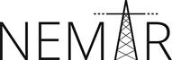

# Ultimate TSDB Comparison

This is an ultimate comparison of time series databases.

## Start the comparison

1. Install dependencies `npm install`
2. Start webserver `npm start`
3. Alternatively start development mode `npm run dev`

## Ultimate-TSDB-Comparison Element Specification

The code below shows a sample element.

    # Template - http://www.example.com

    ## Clusterability Features
    - High Availability
    - Scalability
    - Load Balancing

    ## Functions
    - INS
    - READ
    - SCAN
    - AVG
    - SUM
    - CNT
    - MAX
    - MIN
    - UPD
    - DEL

    ## Advanced Functions
    - Contiunous Calculation
    - Tags
    - Long-term Storage
    - Matrix Time Series

    ## Sampling
    - Downsampling

    ## Smallest Sampling Interval
    - 1 ms
    - 2 ms

    ## Smallest Storage Granularity
    - 1 ms

    ## Smallest Guaranteed Storage Granularity
    - 1 ms
    - \>1 ms

    ## APIs/Interfaces
    - CLI
    - HTTP GUI
    - REST
    - HTTP
    - JSON
    - Kafka
    - statsD
    - UDP
    - Telnet
    - Azure
    - RabbitMQ
    - S3
    - Spritzer
    - Spark
    - Storm
    - Collectd
    - OpenTSDB

    ## Client Libraries
    - Java
    - Python
    - R
    - Groovy
    - .NET
    - Perl
    - PHP
    - Ruby
    - C
    - Node.js
    - ODBC
    - Go
    - J
    - C++
    - Tcl

    ## Extensibility
    - Plugins

    ## License
    - Apache-2.0
    - LGPL-2.0+
    - GPL-3.0-or-later
    - MIT
    - MonetDB Public
    - GPL-2.0-only
    - PostgreSQL

    ## Stable Version
    - yes

    ## Commercial Support
    - yes

## Funding

This project received funding from the
[Federal Ministry for Economic Affairs and Energy](http://www.bmwi.de/Navigation/EN/Home/home.html)
in the context of the project [NEMAR](https://www.nemar.de/).

## License

The content is licensed under [CC0-1.0].

  [CC0-1.0]: https://creativecommons.org/publicdomain/zero/1.0/
